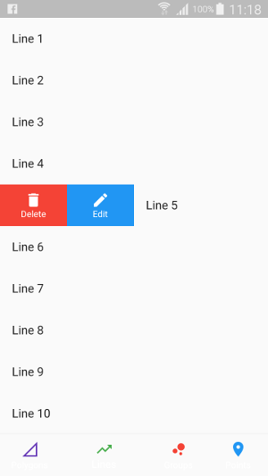

# Geopoint Sql

Sql operations for geospatial data. Uses [Geopoint](https://github.com/synw/geopoint) and [Geojson](https://github.com/synw/geojson) for data structures and [Sqlcool](https://github.com/synw/sqlcool) for database management.

## Documentation

### Init a geospatial database

   ```dart
   import 'package:sqlcool/sqlcool.dart';
   import 'package:geopoint_sql/geopoint_sql.dart';

   final geoDb = Db();
   await geoDb
      .init(
         path: "geodb.sqlite",
         schema: [geoPointSchema, geoSerieSchema],
         verbose: true)
      .catchError((dynamic e) {
         throw ("Can not init geo database $e");
      });
   ```

### Crud operations

For geopoints:

   ```dart
   import 'package:geopoint_sql/geopoint_sql.dart';

   final geoPointSql = GeoPointSql(db: geoDb);
   // save
   geoPointSql.save(
      geoPoint: GeoPoint(name: "point", latitude: 0.0, longitude: 0.0));
   ```

For geoseries:

   ```dart
   import 'package:geopoint_sql/geopoint_sql.dart';

   final geoSerieSql = GeoSerieSql(db: geoDb);
   // save
   geoSerieSql.save(
      geoSerie: GeoSerie(name: "serie1", geoPoints: <GeoPoint>[]));
   // update
   geoSerieSql.update(
      geoSerie: GeoSerie(name: "serie1", geoPoints: <GeoPoint>[]));
   // delete
   geoSerieSql.delete(someExistingGeoserie);
   ```

### Admin crud view

   ```dart
   import 'package:geopoint_sql/geopoint_sql.dart';

   @override
   Widget build(BuildContext context) {
      return Scaffold(
         body: GeoCrudNavigationPage(db: geoDb, activeTab: ActiveTab.line));
   }
   ```


